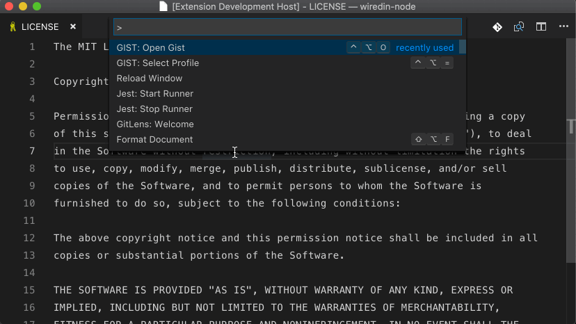

# Gist Extension

[](https://marketplace.visualstudio.com/items?itemName=kenhowardpdx.vscode-gist)
[](https://travis-ci.org/kenhowardpdx/vscode-gist)

[](https://marketplace.visualstudio.com/items?itemName=kenhowardpdx.vscode-gist) [](https://coveralls.io/github/kenhowardpdx/vscode-gist?branch=master)

Access your GitHub Gists within Visual Studio Code. You can add, edit, and delete public and private gists.

## Installation

Press <kbd>F1</kbd> and narrow down the list commands by typing `extension`. Pick `Extensions: Install Extensions`.
Select the `Gist Extension` extension from the list.

## GitHub Profiles

_**NOTE:** You must provide a personal access token to be authenticated with GitHub or a GitHub Enterprise instance._

Press <kbd>F1</kbd> and type `select profile` to initialize the profile selector. You can add as many profiles as you would like.



If you are using a GitHub Enterprise account, be sure to add the appropriate API url. This extension uses the REST v3 API by GitHub. Your GHE API url should look similar to this: `http(s)://[hostname]/api/v3` [(documentation)](https://developer.github.com/enterprise/2.13/v3/#schema)

## Usage

### Create Gists

You must have a file open and active to create a gist.

Press <kbd>F1</kbd> and enter the following:

~~~
GIST: Create New Gist
~~~

You will be prompted a gist description.

### Open/Edit Gists

Press <kbd>F1</kbd> and enter one fo the following:

~~~
GIST: Open Gist
GIST: Open Favorite Gist
~~~

All files associated with the gist will be opened in group layout.

Once you have opened an **owned*** gist, saving it will commit a new revision.

\* an owned gist is one created by you, not a favorited (starred) gist.

You can also use the following commands:

~~~
GIST: Delete Gist
GIST: Delete File
GIST: Add File
GIST: Open Gist In Browser
GIST: Insert Text From Gist File
~~~

## Extension Settings

Mostly you will not need to change these settings.

| Setting | Type | Default Value | Purpose |
|:--------|:-----|:--------------|:--------|
| maxFiles | Number | 10 | The maximum number of files to open without a prompt. |
| defaultPrivate | Boolean | false | Defaults all newly created Gists to PRIVATE. |
| profileOptions | Object | {} | Override profile configuration options. |

`profileOptions` gives you some debugging capabilities. You can provide a profile name along with `key`, `url`, and `rejectUnauthorized` values. Before you can use `profileOptions` you \*MUST\* have the profile created.

```js
interface ProfileOptions {
    key?: string; // the personal access token to use
    url?: string; // the REST endpoint to use
    rejectUnauthorized?: boolean; // set this to false if you are having ssl issues with your enterprise REST endpoint
}
```

An example value for `profileOptions` would be something like this:
```js
{
    "GHE": { // "GHE" MUST correspond with the name used when originally configuring the profile
        "rejectUnauthorized": false
    }
}
```

## All Commands & Keyboard Mappings

Here is a list of commands and their mapped keyboard shortcuts

| Command | Command Pallet Label | Keyboard Mapping | Notes |
|:--------|:---------------------|:-----------------|:------|
|extension.gist.open|Open Gist|ctrl+alt+o|
|extension.gist.openFavorite|Open Favorite Gist|not mapped|
|extension.gist.create|Create New Gist|not mapped|
|extension.gist.openInBrowser|Open Gist In Browser|ctrl+alt+b|
|extension.gist.delete|Delete Gist|not mapped|
|extension.gist.deleteFile|Delete File|not mapped|
|extension.gist.add|Add File|ctrl+alt+a ctrl+alt+a|
|extension.gist.insert|Insert Text From Gist File|not mapped|
|extension.profile.select|Select Profile|ctrl+alt+=|
|extension.resetState|n/a|ctrl+shift+0|Delete All Extension Memory (removes auth tokens)|

## Show Your Support

If you'd like to support Gist, please consider the following &mdash; feel free to choose more than one. &#x1F609;
- [Become a Sponsor](https://www.patreon.com/kenhowardpdx "Become a sponsor on Patreon") &mdash; see [backers](https://github.com/kenhowardpdx/vscode-gist/blob/master/BACKERS.md)
- [Donations via PayPal](https://www.paypal.me/kenhowardpdx "One-time donations via PayPal")
- [Donations via Cash App](https://cash.me/$kenhowardpdx "One-time donations via Cash App")
- [Write a Review](https://marketplace.visualstudio.com/items?itemName=kenhowardpdx.vscode-gist#review-details "Write a review")
- [Star or Fork me on GitHub](https://github.com/kenhowardpdx/vscode-gist "Star or fork me on GitHub")
- [Follow me on Twitter](https://twitter.com/kenhowardpdx "Follow me on Twitter")

## Maintainer
vscode-gist is maintained by [Ken Howard](https://github.com/kenhowardpdx).
